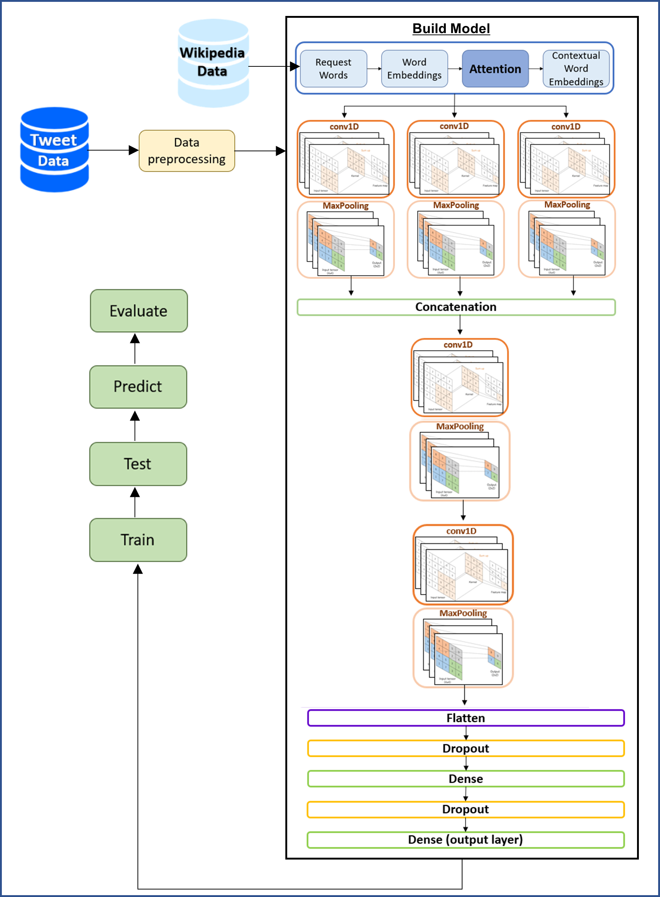

# Fake-News-Detection-With-BERT
## Introduction
This program developed as final project of a software engineering degree, focuses on the implementation of deep learning techniques.\
The aim of this project is to evaluate the performance of `CNN` and `LSTM` models for detecting fake news, utilizing both `SMALL BERT`\
and `LARGE BERT` pre-trained models  on a dataset specifically compiled for this purpose.\
The program is built using `Python version 3.8` and utilizes `TensorFlow 2.10.0`, `PyQt5` and other required libraries.

## Requirements
- Python version 3.8 or higher
- TensorFlow 2.10.0
- PyQt5

***To install additional requirements, run the following commands:***
```
pip install -q -U tensorflow-text
pip install -q tf-models-official 
pip install requirements.txt
```
## Database
The program uses a dataset of fake news, specifically the `COVID19 Fake News Dataset NLP`.\
Any supported formats of data can be used.
>Download dataset from [here](https://www.kaggle.com/datasets/elvinagammed/covid19-fake-news-dataset-nlp)

### BERT Installation
The program utilizes BERT for text processing and feature extraction. Both SMALL BERT and LARGE BERT can be used.\
However, due to the large file sizes, it is recommended to download them separately and place them in the designated BERT folders.
>Download the **preprocessor** from [here](https://tfhub.dev/tensorflow/bert_en_uncased_preprocess/3), unzip the archive and place the content files in **BERT/preprocessor** and **BERT/largePreprocessor** directories

>For `SMALL BERT`, download the encoder from [here](https://tfhub.dev/tensorflow/bert_en_uncased_L-12_H-768_A-12/4), unzip the archive and place the content files in the **BERT/encoder** directory

>For `LARGE BERT`, download the encoder from [here](https://tfhub.dev/tensorflow/bert_en_uncased_L-24_H-1024_A-16/4), unzip the archive and place the content files in the**BERT/largeEncoder** directory

## Model Architecture 
###### CNN model with pre-trained BERT:

###### LSTM structure:


## Run
>To run the program, navigate to the *controllers* package and run the [main.py](controllers/main.py) file.

## Illustration
An illustration of the program can be seen in the following YouTube video: 
[](http://www.youtube.com/watch?v=G-WATkrte3g)

## Authors
- **Alona Melnichenko** - [Alona's GitHub](https://github.com/AlonaMel)

- **Ameer Dalal** - [Ameer's GitHub](https://github.com/AmeerDlal)